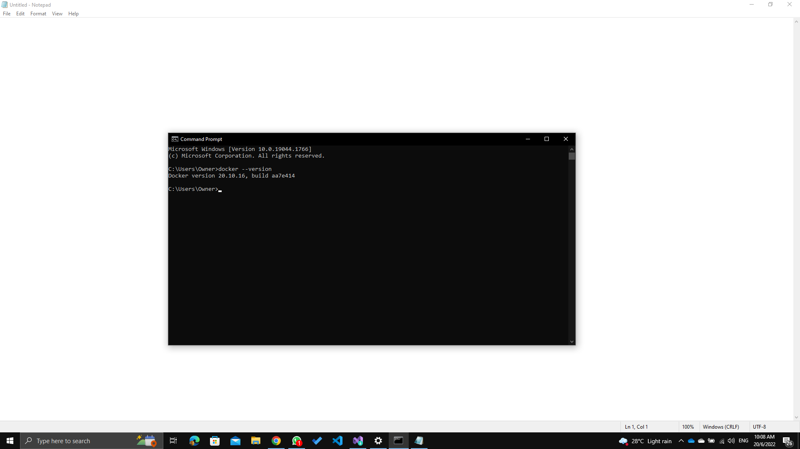
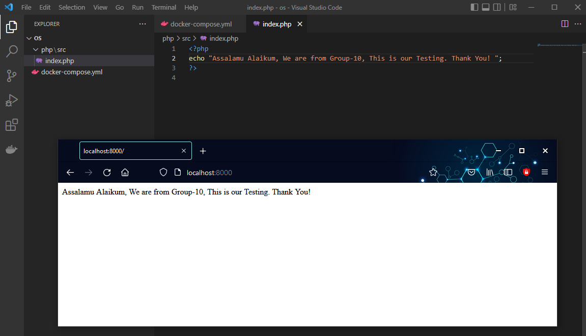
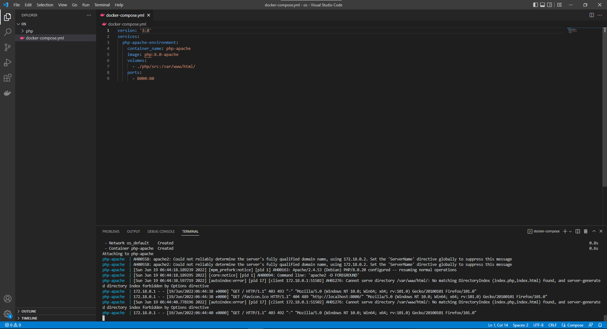
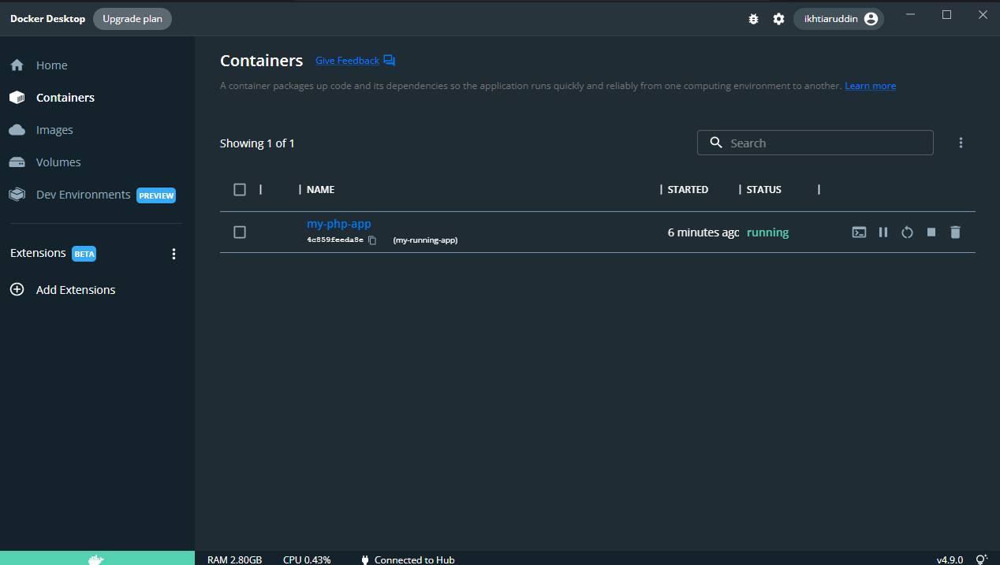
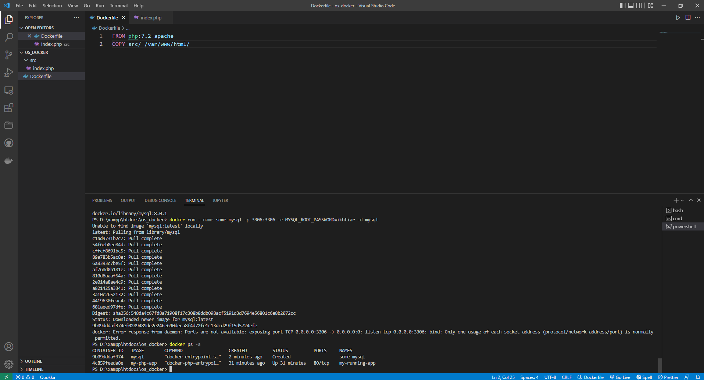
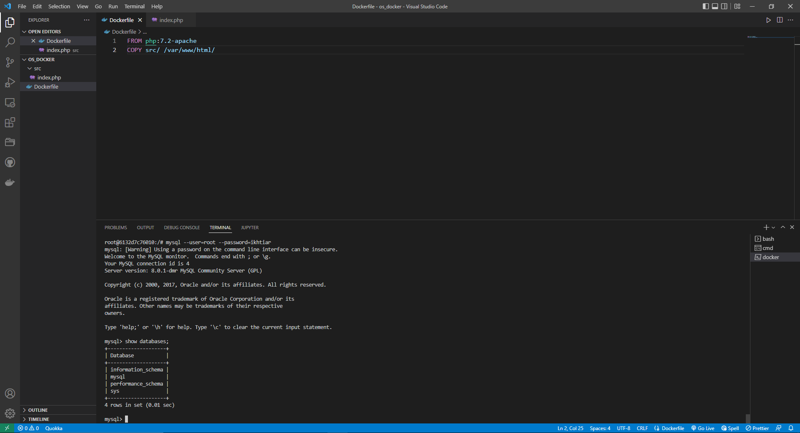
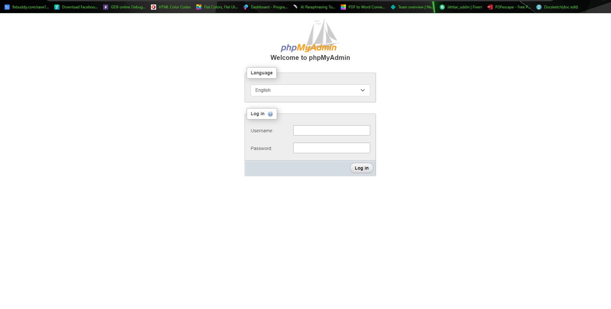

# Tutorial to deploy a complete Apache, PHP,MYSQL and PHPMYADMIN service on windows


## CSCI 3300 Section 02 OPERATING SYSTEMS
 
**PREPARED BY: GROUP-10**


<table>
  <tr>
   <td><strong>NAME</strong>
   </td>
   <td><strong>MATRIC NO.</strong>
   </td>
  </tr>
  <tr>
   <td><strong>MD IKHTIAR UDDIN HOWLADER (G. LEADER)</strong>
   </td>
   <td><strong>1834619</strong>
   </td>
  </tr>
  <tr>
   <td><strong>RASEL AHMED</strong>
   </td>
   <td><strong>1836247</strong>
   </td>
  </tr>
  <tr>
   <td><strong>Mohammad Sazidur Rahman</strong>
   </td>
   <td><strong>1835197</strong>
   </td>
  </tr>
</table>


### 1. Introduction:
An operating system is a piece of software that connects the user to the computer hardware. After being loaded into a computer by a boot software, it is the programme that administers all of the other application programmes in the computer. Users may interact with the OS using a command line interface (CLI) or a graphical user interface (GUI), which is often done with a keyboard, mouse, or touchscreen. An operating system is very useful for computer software and software development. Without an operating system, each programme would need its own user interface as well as the considerable code necessary to manage all of the underlying computer's low-level tasks, such as disc storage, network connections, and so on.

### 2. Docker:
Docker is basically a software development platform and a sort of virtualization technology that enables us to create and deploy programmes inside neat virtual containerized environments. It implies that applications behave the same regardless of where they are or what system they are running on. Docker containers may be deployed to practically any computer without introducing compatibility issues, guaranteeing that your software stays system agnostic, making it easy to use, build, maintain, and deploy. Docker is intended to give a rapid and lightweight environment in which code can be executed quickly, as well as an extra facility of the competent work process to remove code from the computer for testing before production.
Unlike a virtual machine, Docker is a sort of virtualization in which resources are shared directly with the host. This allows us to construct containers and operate several Docker containers in situations where we would only be able to host a few virtual machines. A virtual machine must set aside a particular amount of resources, such as HDD space, memory, and processing power, mimic hardware, and boot a whole operating system before connecting with the host computer through a tarator programme called a "Hypervisor" that runs on the host operating system. Docker links directly to the system kernel on Linux systems, as well as Windows 10 and Windows Server 2016 and later. This implies that any version of Linux may be run natively in a container. Not only that, but Docker uses less disc space since it uses a tiered file system to effectively reuse data.

### 3. Required Installation steps and procedures:

1. First go to [https://hub.docker.com/](https://hub.docker.com/)
2. Register or Sign in.
3. Download Docker Desktop Installer file for your operating system.
4. Enable Virtualization Hyper-V.
5. Install Docker Destop.
6. Run the Docker Destop application.
7. Check the Docker is properly installed or not on Command Prompt for Windows and Terminal for MacOS

**Command:** 
```
docker --version
```




**This indicates that the Docker installed successfully.**


### 4. Deploy PHP on docker:

1. First we need to create an index.php file in project directory,./php/src.
2. Let's run any PHP code and it will be run from directory we specified in the volume of our docker-compose./php/src.
3. After refresh por browser with ([https://localhost:8000/](https://localhost:8000/)), result should be visible.




### 5. Deploy Apache on docker:

- Container: The container name is simply a name for our PHP container that we choose at random. 
  For example, php-apache is a container name.

- PHP image: which is the version of PHP Apache we wish to use. We are using the Docker hub to get image: php:8.0-apache in this example.

- Volume: will create a working src directory for our code or source files in our current working directory. That file would have to be in that directory if we want to run a PHP script.

Such As:volumes:- ./php/src:/var/www/html/

- Ports:  Port numbers are important. This specifies the ports from which the script will run. It will map the port on your local computer to an Apache server port.

Consider the following scenario:ports: - 8000:80

This is how  docker-compose.yml should look like.Let’s test it out.



Now, If we open Docekr desktop, The container should be up and runnig.




### 6. Deploy MySQL on docker:

 In order to run MySQL on docker we need to make sure that the Docker is running on your desktop.
 After that we can proceed to obtain a MySQL docker image by typing the following: 
 
```
docker pull mysql:8.0.1
```

The previous command will download the version 8.0.1 of mysql within an image available in the Docker store.
So now we can run it into our local machine by:

```
docker run --name some-mysql -p 3306:3306 -e MYSQL_ROOT_PASSWORD=ikhtiar -d mysql
```
 
Let's explain the options for the command docker run.  
- The option --name allows us to assign a specific name for our running container.    

- The option -e is used to pass a value to the container environment variable MYSQL_ROOT_PASSWORD. This variable is requested by the image to run properly and it will be assigned to the root password of MySQL. 

- The option -d means that docker will run the container in the background in “detached” mode. 

If everything went well we could see the running container by typing the following command:

```
docker ps -a
```


 
 Finally, we can check the access to the mysql instance using docker exec command,
 
 
 
 
 
### 7. Obtaing and Running phpMyAdmin on docker:

### 8. Access phpMyAdmin:

You only need to open your favourite browser and type the following url: http://localhost:8081/ so your instance of phpMyAdmin will show up. To access, type root as username and the password you established in the step one when running the mysql container (if you followed the tutorial the password is ikhtiar -d).



After that you have to put your password.


